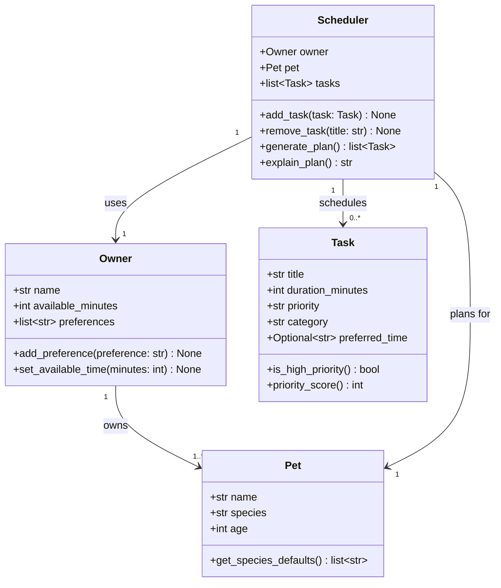

# PawPal+ Project Reflection

## 1. System Design

**a. Initial design**
Core User Actions:
- Briefly describe your initial UML design.
- What classes did you include, and what responsibilities did you assign to each?

Three core actions anybody should be able to perform:

1. Provide basic details of the owner and the pet, and the scheduler will know whom it is planning for.
2. Create tasks with a title, duration, priority (low, medium, high), and category (walk, feed, medication, etc.) with an optional time of day.
3. Ask the scheduler to generate an ordered plan of tasks for the day, fitting them in the owner's available time and prioritizing the tasks.

The structure is based on four classes:

- **Owner**: Holds information about the owner's name, minutes available per day for pet care, and personal preferences. Manages representing the human side of the equation.
- **Pet**: Holds information about the pet's name, species, and age. Links to an Owner. Manages representing the animal being cared for.
- **Task**: A dataclass for information about what needs to be done (title and category), how long it takes, and a preferred time slot. Manages representing individual care activities.
- **Scheduler**: Holds information about an Owner, a Pet, and a list of Tasks. Manages generating a daily plan.

After asking Claude Code to create a Mermaid.js class diagram based on brainstormed attributes and methods.
UML class diagram (Mermaid):

**b. Design changes**

- Did your design change during implementation?
- If yes, describe at least one change and why you made it.

No design changes were made during implementation. The four classes and their attributes and methods remained exactly as defined in the initial UML diagram.

---

## 2. Scheduling Logic and Tradeoffs

**a. Constraints and priorities**

- What constraints does your scheduler consider (for example: time, priority, preferences)?
- How did you decide which constraints mattered most?

**b. Tradeoffs**

- Describe one tradeoff your scheduler makes.
- Why is that tradeoff reasonable for this scenario?

---

## 3. AI Collaboration

**a. How you used AI**

- How did you use AI tools during this project (for example: design brainstorming, debugging, refactoring)?
- What kinds of prompts or questions were most helpful?

**b. Judgment and verification**

- Describe one moment where you did not accept an AI suggestion as-is.
- How did you evaluate or verify what the AI suggested?

---

## 4. Testing and Verification

**a. What you tested**

- What behaviors did you test?
- Why were these tests important?

**b. Confidence**

- How confident are you that your scheduler works correctly?
- What edge cases would you test next if you had more time?

---

## 5. Reflection

**a. What went well**

- What part of this project are you most satisfied with?

**b. What you would improve**

- If you had another iteration, what would you improve or redesign?

**c. Key takeaway**

- What is one important thing you learned about designing systems or working with AI on this project?
