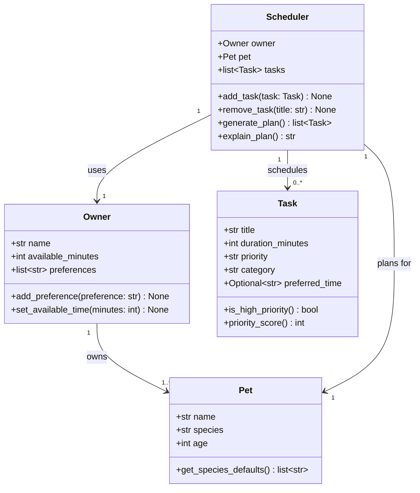
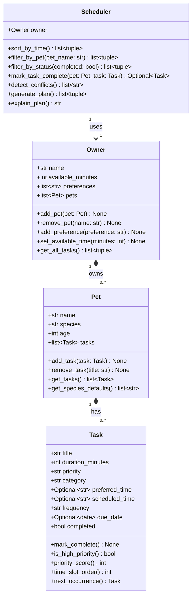

# PawPal+ Project Reflection

## 1. System Design

**a. Initial design**
Core User Actions:
- Briefly describe your initial UML design.
- What classes did you include, and what responsibilities did you assign to each?

Three core actions anybody should be able to perform:

1. Provide basic details of the owner and the pet, and the scheduler will know whom it is planning for.
2. Create tasks with a title, duration, priority (low, medium, high), and category (walk, feed, medication, etc.) with an optional time of day.
3. Ask the scheduler to generate an ordered plan of tasks for the day, fitting them in the owner's available time and prioritizing the tasks.

The structure is based on four classes:

- **Owner**: Holds information about the owner's name, minutes available per day for pet care, and personal preferences. Manages representing the human side of the equation.
- **Pet**: Holds information about the pet's name, species, and age. Links to an Owner. Manages representing the animal being cared for.
- **Task**: A dataclass for information about what needs to be done (title and category), how long it takes, and a preferred time slot. Manages representing individual care activities.
- **Scheduler**: Holds information about an Owner, a Pet, and a list of Tasks. Manages generating a daily plan.

After asking Claude Code to create a Mermaid.js class diagram based on brainstormed attributes and methods.
UML class diagram (Mermaid):

**Final UML class diagram (updated to match implementation):**

---

**b. Design changes**

- Did your design change during implementation?
- If yes, describe at least one change and why you made it.

No design changes were made during implementation. The four classes and their attributes and methods remained exactly as defined in the initial UML diagram.

---

## 2. Scheduling Logic and Tradeoffs

**a. Constraints and priorities**

- What constraints does your scheduler consider (for example: time, priority, preferences)?
- How did you decide which constraints mattered most?

The constraints it will consider are the amount of time the owner has in a day and the level of priority of each task. The scheduler will fill the day by choosing the most important tasks first and continue until there's no time left for the next task.

I have decided that the most important factor was the level of priority of each task. This was due to the fact that there are tasks that must be completed, like giving medication to a pet. The amount of time was the second most important factor. This was due to the fact that regardless of the importance of the task, the owner only had so much time in a day. The time of day was used as a tiebreaker if two tasks had the same level of priority.

**b. Tradeoffs**

- Describe one tradeoff your scheduler makes.
- Why is that tradeoff reasonable for this scenario?

The conflict detector only checks if two tasks are scheduled at exactly the same time. However, it does not verify if two tasks might have a conflict by checking if the end time of one task might overlap with the start time of the other. For example, if one task has a duration of 30 minutes and starts at 8:00, and another task starts at 8:15, it will not be detected by this function. However, it will be running at the same time. This trade-off is acceptable for now. However, it does catch obvious errors like two tasks being scheduled at the same time by accident. In the future, we could extend this function by also checking the duration of each task.

---

## 3. AI Collaboration

**a. How you used AI**

- How did you use AI tools during this project (for example: design brainstorming, debugging, refactoring)?
- What kinds of prompts or questions were most helpful?

**b. Judgment and verification**

- Describe one moment where you did not accept an AI suggestion as-is.
- How did you evaluate or verify what the AI suggested?

---

## 4. Testing and Verification

**a. What you tested**

- What behaviors did you test?
- Why were these tests important?

**b. Confidence**

- How confident are you that your scheduler works correctly?
- What edge cases would you test next if you had more time?

---

## 5. Reflection

**a. What went well**

- What part of this project are you most satisfied with?

**b. What you would improve**

- If you had another iteration, what would you improve or redesign?

**c. Key takeaway**

- What is one important thing you learned about designing systems or working with AI on this project?
